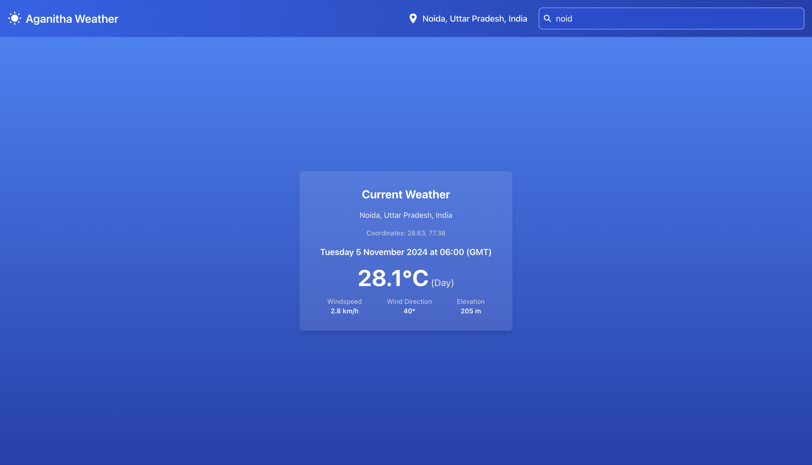

# Aganitha Weather App 🌤️

A React-based weather application that displays the current weather of a selected city. The app uses the Open-Meteo API to retrieve real-time weather data and Tailwind CSS for a modern, responsive UI.

## Table of Contents

- [Features](#features)
- [Demo](#demo)
- [Technologies Used](#technologies-used)
- [Setup Instructions](#setup-instructions)
- [Project Structure](#project-structure)
- [Usage](#usage)
- [License](#license)

## Features

- **City Search**: Search for any city to get current weather data.
- **Real-time Data**: Displays temperature, wind speed, direction, and other weather details using the Open-Meteo API.
- **Responsive UI**: Designed for mobile and desktop with Tailwind CSS.
- **Custom Components**: Reusable and modular React components for easy maintenance.

## Demo



## Technologies Used

- **React**: A JavaScript library for building user interfaces.
- **Tailwind CSS**: A utility-first CSS framework for fast UI development.
- **Open-Meteo API**: Fetches real-time weather data for selected cities.
- **React Icons**: For consistent and scalable icons across the app.

## Setup Instructions

### Prerequisites

- [Node.js](https://nodejs.org/) (version 14 or higher)
- [npm](https://npmjs.com/) or [Yarn](https://yarnpkg.com/) (package manager)

### Steps

1. **Clone the Repository**

   ```bash
   git clone https://github.com/gkhore9691/WeatherApp.git
   cd WeatherApp
   ```

2. **Install Dependencies**

   ```bash
   npm install
   ```

   or, if using Yarn:

   ```bash
   yarn install
   ```

3. **Start the Application**

   ```bash
   npm start
   ```

   or with Yarn:

   ```bash
   yarn start
   ```

   The application should now be running on `http://localhost:3000`.

## Project Structure

```plaintext
aganitha-weather-app/
├── public/                 # Static assets
├── src/
│   ├── components/         # Reusable React components
│   │   ├── Searchbar.js
│   │   └── WeatherDisplay.js
|   │   └── NoData.js
│   ├── Context/            # Context for managing app-wide state
│   │   └── AppContext.js
│   ├── Hooks/
│   │   └── useLocation.js  # Custom hook for fetching location data
│   |   └── useWeather.js   # Custom hook for fetching weather data
│   ├── Services/
│   │   └── fetchWeatherData.js # Fetches weather data from Open-Meteo API
│   |   └── fetchLocationData.js # Fetches location data from Open-Meteo API
│   ├── App.js              # Main application component
│   └── index.js            # App entry point
└── README.md
```

## Usage

- **Search for a City**: Use the search bar at the top to look up a city. Results will populate based on your search, and selecting one will fetch and display the weather data.
- **Weather Display**: The main section shows details like temperature, wind speed, direction, and whether it’s day or night in the selected location.